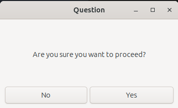

# zigenity

Like [zenity](https://gitlab.gnome.org/GNOME/zenity) but in [Zig](https://ziglang.org/) and only for Linux.

## Dialog Types

| Type | Supported |
|:----:|:---------:|
| calendar | |
| entry | |
| error | |
| info | |
| file-selection | |
| list | |
| notification | |
| progress | |
| question | ✅ |
| warning | |
| scale | |
| text-info | |
| color-selection | |
| password | ✅ |
| forms | |

## Getting started

Run `zigenity --help` for a list of options.

This application uses the same return codes and options as [zenity](https://gitlab.gnome.org/GNOME/zenity), including:
* `0` - Ok button was pressed
* `1` - Cancel button was pressed
* `5` - Timeout (this is only returned when using the `--timeout` option)
* `255` - Some other error (e.g., no dialog type has been selected)
